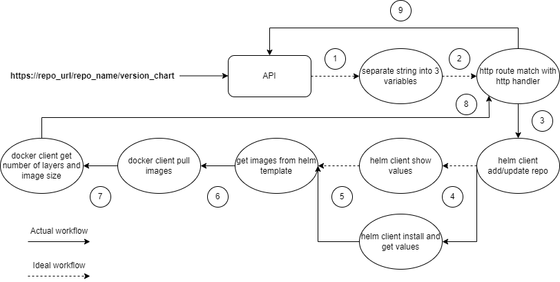

# **Golang API**
Golang API developed from an exercise for a technical test.

Task - Create an API to accept a link to a helm chart, search for container images. Download docker images from their respective
repositories and return a response of the list of images, their size and no. of layers in each image.

## **API structure**

```bash
api_golang
├── go.mod
├── README.md 
├── go.sum
├── image.png
└── main.go
```
## **API workflow**
The API workflow is defined in the following image:


#### **Running the task**
   - `go run main.go`


## **References**
https://github.com/PrasadG193/helm-clientgo-example/tree/master